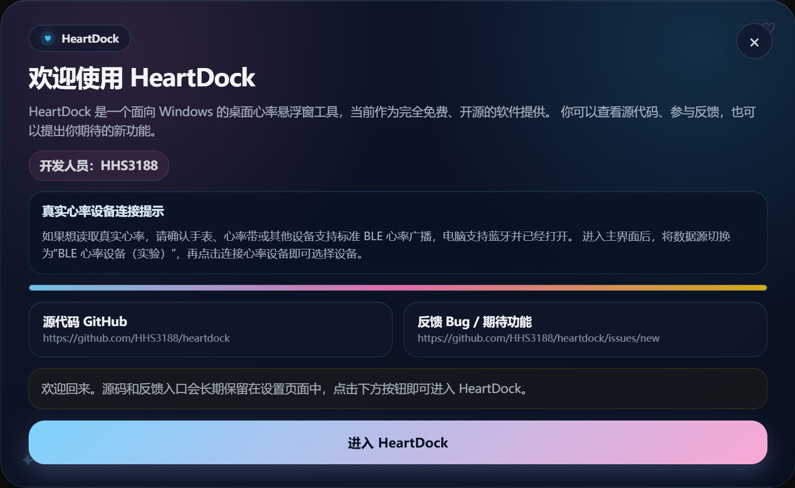

# HeartDock

HeartDock 是一个面向 Windows 的桌面心率悬浮窗工具。

它基于 Electron + React 构建，目标是提供一个轻量、清爽、可定制的心率显示窗口，适合桌面显示、直播、录屏叠加和日常观察心率变化。

当前项目处于早期预发布阶段，已经支持模拟心率、手动输入心率，以及实验性的标准 BLE 心率设备读取。

---

## 界面预览



---

## 当前版本

当前最新预发布版本：**v0.5.0**

v0.5.0 主要完成了显示框样式预设、应用图标、启动页、日间 / 黑夜模式、Windows 安装包发布准备，以及多项设置页和纯享模式体验优化：

- 支持显示框样式预设切换
- 支持无背景、柔和玻璃卡片、圆角胶囊、霓虹直播框、二次元贴纸风等样式
- 新增 HeartDock 应用图标，并配置 Windows exe / 安装包图标
- 新增启动页和首次启动说明，说明免费开源、源码地址、反馈入口和 BLE 使用前提
- 首次启动需等待 15 秒并确认阅读，后续启动显示启动页后手动进入
- 新增应用内源代码 GitHub 入口和 Bug / 功能期待反馈入口
- 新增日间 / 黑夜模式切换
- 优化启动页和设置页窗口大小隔离，启动页不再被设置页保存尺寸污染
- 优化日间模式下的文字可读性、BLE 状态区域和心率显示区域
- 优化纯享模式命中范围，仅心率本体区域触发交互
- 修复纯享模式下点击后命中范围异常变大的问题
- 优化自定义下拉菜单，支持内部滚动和展开过渡动画
- 优化模拟心率刷新间隔输入控件，改为紧凑输入和自定义步进按钮
- 修复输入框文本选中不可见的问题
- 生成 Windows NSIS 安装包，准备通过 GitHub Release 分发

---

## 功能特性

- 桌面心率悬浮窗
- Windows 安装包
- HeartDock 应用图标
- 启动页和首次启动说明
- 日间 / 黑夜模式切换
- 应用内源代码 GitHub 入口
- 应用内 Bug 反馈 / 功能期待入口
- 始终置顶
- 模拟心率数据源
- 手动输入心率数据源
- 实验性 BLE 心率设备数据源
- 支持标准 BLE Heart Rate Service
- 支持 BLE 断开后的快速重连
- 支持自定义心率前缀标识和单位文字
- 支持固定颜色和心率区间颜色
- 支持自定义心率区间范围
- 支持心率数字发光强度调整
- 支持显示框样式预设
- 支持无背景、玻璃卡片、胶囊卡片、霓虹直播框和二次元贴纸风
- 字体大小和模拟心率刷新间隔设置
- 鼠标穿透交互
- 纯享心率显示模式
- 纯享模式下拖动心率位置
- 纯享模式命中范围限制在心率本体区域
- 设置窗口自定义缩放手柄
- 本地配置保存
- 中文设置界面

---

## 普通用户安装

从 GitHub Release 下载 Windows 安装包：

- `HeartDock Setup 0.5.0.exe`

安装后直接运行 HeartDock 即可，不需要安装 Node.js 或 npm。

首次启动时会显示启动说明页，需要等待 15 秒并确认阅读后进入主界面。后续启动仍会先显示启动页，点击“进入 HeartDock”即可进入设置页。

> 当前安装包未购买代码签名证书，Windows 可能提示“未知发布者”或 SmartScreen 风险提示。这是早期免费开源版本常见现象，不代表程序一定有问题。请只从本项目 GitHub Release 页面下载。

---

## 从源码运行

### 1. 安装依赖

```bash
npm install
```

### 2. 启动开发模式

```bash
npm run dev
```

启动成功后，HeartDock 会以 Electron 窗口形式运行。

如果安装依赖时 Electron 下载失败，请查看：

[开发环境与依赖安装说明](docs/dev-setup.md)

---

## 数据源模式

HeartDock 当前支持三种心率数据源：

| 数据源 | 说明 |
|---|---|
| 模拟心率 | 自动生成模拟 BPM，适合测试界面样式和颜色变化 |
| 手动输入 | 固定显示用户输入的 BPM，适合调试、演示或临时展示 |
| BLE 心率设备（实验） | 连接支持标准 BLE Heart Rate Service 的设备并读取实时心率 |

BLE 模式优先支持标准蓝牙心率服务：

- Heart Rate Service：`0x180D`
- Heart Rate Measurement：`0x2A37`

如果设备使用厂商私有协议、需要认证密钥，或者不广播标准心率服务，当前版本可能无法直接读取。

更多 BLE 使用说明见：

[BLE 心率设备使用说明](docs/ble-guide.md)

---

## 显示样式自定义

HeartDock 当前支持对心率显示进行基础自定义：

| 设置项 | 说明 |
|---|---|
| 前缀标识 | 可以改成 `♥`、`♡`、`HR`、`心率` 等 |
| 单位文字 | 可以改成 `bpm`、`BPM`、`次/分`，也可以留空 |
| 颜色模式 | 可以选择跟随心率区间颜色，或使用固定颜色 |
| 固定颜色 | 在固定颜色模式下，心率数字和前缀会使用同一种颜色 |
| 区间颜色 | 可以自定义不同 BPM 区间对应的颜色 |
| 区间范围 | 可以调整每个颜色区间的上下限，相邻区间会自动顺延 |
| 发光强度 | 支持关闭、弱、中、强几档发光效果 |
| 显示框样式 | 可以切换无背景、柔和玻璃卡片、圆角胶囊、霓虹直播框、二次元贴纸风等预设 |

这些设置会同时作用于普通显示模式和纯享心率显示模式。

---

## 显示框样式预设

HeartDock 当前内置多种显示框样式，方便快速切换不同使用场景：

| 样式 | 说明 |
|---|---|
| 无背景 | 只显示心率内容，不显示额外卡片背景，适合追求最干净的桌面叠加 |
| 柔和玻璃卡片 | 半透明卡片风格，适合日常桌面观察 |
| 圆角胶囊 | 更紧凑的圆角显示框，适合小尺寸悬浮显示 |
| 霓虹直播框 | 带有更明显的发光边框，适合直播和录屏叠加 |
| 二次元贴纸风 | 偏可爱的粉蓝贴纸感样式，带有爱心和星星等装饰元素 |

后续可以继续扩展更多预设，并在样式体系稳定后考虑主题导入导出能力。

---

## 纯享心率显示模式

纯享模式适合正式桌面显示、直播或录屏叠加。

开启后会隐藏设置面板、顶部标识和关闭按钮，只保留心率显示内容。实际显示内容会根据自定义设置变化，例如：

- 前缀标识
- BPM 数字
- 单位文字
- 心率颜色
- 发光强度
- 显示框样式

纯享模式支持：

- 背景透明
- 按住心率本体拖动位置
- 双击心率区域退出纯享模式
- 将鼠标交互命中范围限制在心率本体区域，减少透明窗口空白区域误触发

---

## 快捷键

| 快捷键 | 功能 |
|---|---|
| `Ctrl + Shift + H` | 开启 / 关闭鼠标穿透交互 |

鼠标穿透交互开启后，鼠标点击会穿过 HeartDock，直接操作下方窗口。  
如果误开启鼠标穿透交互，可以用 `Ctrl + Shift + H` 关闭。

---

## 文档导航

| 文档 | 说明 |
|---|---|
| [开发环境与依赖安装说明](docs/dev-setup.md) | Node.js、npm install、Electron 下载失败、镜像配置和常见排错 |
| [BLE 心率设备使用说明](docs/ble-guide.md) | 标准 BLE 心率设备连接、断线重连和常见问题排查 |
| [Electron 开发注意事项](docs/electron-notes.md) | 透明窗口、点击穿透、窗口状态保存、安全配置和维护建议 |
| [悬浮窗限制说明](docs/overlay-limitations.md) | HeartDock 适合哪些窗口场景，以及哪些场景不保证可用 |
| [开发路线图](docs/roadmap.md) | 当前版本进度和后续计划 |
| [已知问题说明](docs/known-issues.md) | 当前版本的已知问题、临时建议和后续修复方向 |

---

## 当前限制

HeartDock 当前仍处于早期预发布阶段，主要限制包括：

- BLE 心率数据源仍为实验功能
- 暂不保证所有 BLE 设备都能连接
- 暂未支持后台自动重连
- 已提供早期 Windows 安装包，但暂未进行代码签名
- 自定义图片背景 / 图片框显示尚未作为完整功能开放
- 主题导入导出能力尚未实现
- 独占全屏程序上方显示不保证可用
- 透明窗口和鼠标穿透交互在不同 Windows 环境下可能存在差异
- 鼠标穿透交互关闭时在部分环境下可能偶发退出，详见 [已知问题说明](docs/known-issues.md)

更多说明见：

[悬浮窗限制说明](docs/overlay-limitations.md)

---

## 开发路线

详细路线见：

[开发路线图](docs/roadmap.md)

---

## 许可证

本项目使用 **GNU Affero General Public License v3.0 only** 开源许可证。

如果你修改、分发本项目，或者将修改后的版本作为网络服务提供给他人使用，需要遵守 AGPL v3.0 的相关条款，并按要求开放对应源码。

详情请查看 [LICENSE](LICENSE)。
